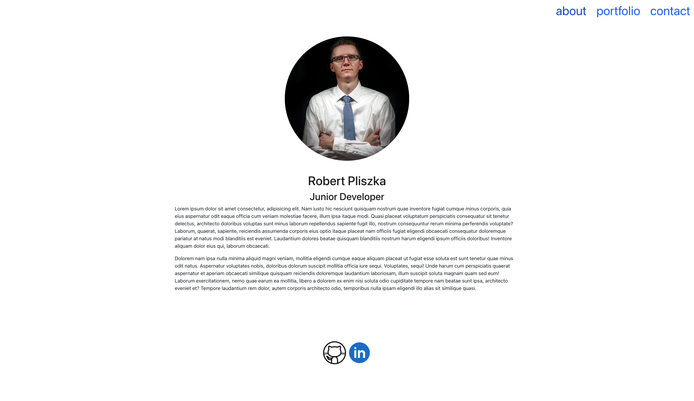
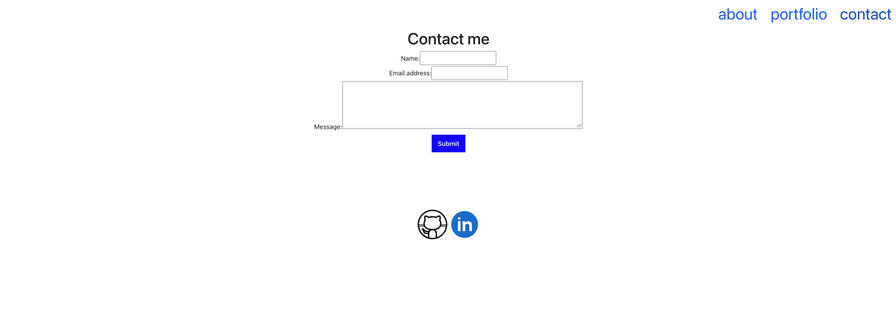
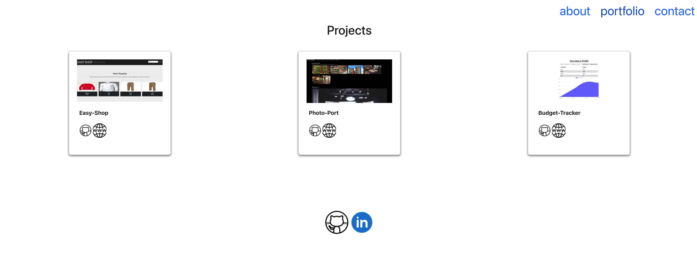

# React Portfolio

## Description

This is my presonal portfolio which shows my skills. There is a page that lists some of the projects I completed in the bootcamp, about me page, and a contact page for me. Website also has links to my github and linkedIn for contact.

## Table of Content

- [Description](#description)
- [Installation](#instalation)
- [Website Links](#website-links)
- [Screenshot](#screenshot)
- [Links](#links)

## Instalation

- Clone repository
- Run `$ npm i ` to install all NPM packages.

## Website Links

- About - is the default page which shows a little biography about me
- Contact - is a form to contact me
- Portfolio - lists some of the projects completed in the class

## Screenshot

- Homepage
  
- Contact
  
- Portfolio
  

## Links

- Github Repository - https://github.com/rpliszka1987/react-portfolio
- URL - https://rpliszka1987.github.io/react-portfolio/

[Back to Top](#react-portfolio)
